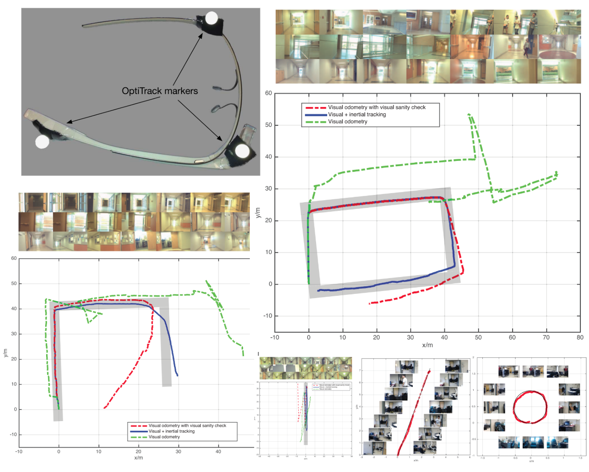

## Few shot Robot Task Learning 

This project is designed to empower robots to learn complex manipulation tasks using a <ins>**limited number of human-operated demonstrations**</ins>. Developed in 2021, the approach aims to simplify robot teaching for **NON-EXPERTS** while overcoming common challenges such as **noisy data, exploration inefficiencies, and the scarcity of demonstration episodes**.

The problem focused on solving the task learning method in sparse reward, and low success rate tryout espisodes. 

#### [EasyTeaching: A Keyframe-Driven Framework for Robotic Manipulation Learning](https://yanxxx.github.io/EasyTeaching/) 

<table width="100%">
  <tbody>
    <tr>
      <td align="left" width = "30%">
        
      </td>
      <td align="left" width = "70%">The EasyTeaching framework is designed to empower robots to learn complex manipulation tasks using a <ins>**limited number of human-operated demonstrations**</ins>. Developed in 2021, the approach aims to simplify robot teaching for **NON-EXPERTS** while overcoming common challenges such as **noisy data, exploration inefficiencies, and the scarcity of demonstration episodes**. </td>
    </tr>
  </tbody>
</table>

Project supported engineering: 
#### Teleoperated Colabration Robot Digital Twin 

## Level-2 Autonomous Driving Project 

This project is a preliminary vehicle automation research project. Include: exploring new sensor calibration, vehicle detection with thermal-RGB sensor, lane detection with RGB camera, and panoptic segmentation with RGB camera. 
#### Instance segmentation for vehicle automation

<table width="100%">
  <tbody>
    <tr>
      <td align="left" width = "30%">
        
      </td>
      <td align="left" width = "70%">The light-weight thermal-RGB-inertial sensing units are now gaining increasing research attention, due to their heterogeneous and complementary properties. A robust and accurate registration between a thermal-RGB camera and an inertial sensor is a necessity for effective thermal-RGB-inertial fusion, which is an indispensable procedure for reliable tracking and mapping tasks. This paper presents an accurate calibration method to geometrically correlate the spatial relationships between an RGB camera, a thermal camera and an inertial measurement unit (IMU). The calibration proceeds within the unified calibration framework (thermal-to-RGB, RGB-to-IMU). The extrinsic parameters are estimated by jointly optimizing both the chessboard corner reprojection errors and acceleration and angular velocity error terms. Extensive evaluations have been performed on the collected thermal-RGB-inertial measurements. In this experiments study, the average RMS translation and Euler angle errors are less than 6 mm and 0.04 rad respectively under 20% artificial noise.</td>
    </tr>
  </tbody>
</table>

#### Distinguish detected lane markers into sepearate lanes 

<table width="100%">
  <tbody>
    <tr>
      <td align="left" width = "30%">
        
      </td>
      <td align="left" width = "70%">The light-weight thermal-RGB-inertial sensing units are now gaining increasing research attention, due to their heterogeneous and complementary properties. A robust and accurate registration between a thermal-RGB camera and an inertial sensor is a necessity for effective thermal-RGB-inertial fusion, which is an indispensable procedure for reliable tracking and mapping tasks. This paper presents an accurate calibration method to geometrically correlate the spatial relationships between an RGB camera, a thermal camera and an inertial measurement unit (IMU). The calibration proceeds within the unified calibration framework (thermal-to-RGB, RGB-to-IMU). The extrinsic parameters are estimated by jointly optimizing both the chessboard corner reprojection errors and acceleration and angular velocity error terms. Extensive evaluations have been performed on the collected thermal-RGB-inertial measurements. In this experiments study, the average RMS translation and Euler angle errors are less than 6 mm and 0.04 rad respectively under 20% artificial noise.</td>
    </tr>
  </tbody>
</table>

#### Robust Thermal-RGB vehicle detection

<table width="100%">
  <tbody>
    <tr>
      <td align="left" width = "30%">
        
      </td>
      <td align="left" width = "70%">The light-weight thermal-RGB-inertial sensing units are now gaining increasing research attention, due to their heterogeneous and complementary properties. A robust and accurate registration between a thermal-RGB camera and an inertial sensor is a necessity for effective thermal-RGB-inertial fusion, which is an indispensable procedure for reliable tracking and mapping tasks. This paper presents an accurate calibration method to geometrically correlate the spatial relationships between an RGB camera, a thermal camera and an inertial measurement unit (IMU). The calibration proceeds within the unified calibration framework (thermal-to-RGB, RGB-to-IMU). The extrinsic parameters are estimated by jointly optimizing both the chessboard corner reprojection errors and acceleration and angular velocity error terms. Extensive evaluations have been performed on the collected thermal-RGB-inertial measurements. In this experiments study, the average RMS translation and Euler angle errors are less than 6 mm and 0.04 rad respectively under 20% artificial noise.</td>
    </tr>
  </tbody>
</table>

#### Spatial calibration for thermal-rgb cameras and inertial sensor system 

<table width="100%">
  <tbody>
    <tr>
      <td align="left" width = "30%">
        
      </td>
      <td align="left" width = "70%">The light-weight thermal-RGB-inertial sensing units are now gaining increasing research attention, due to their heterogeneous and complementary properties. A robust and accurate registration between a thermal-RGB camera and an inertial sensor is a necessity for effective thermal-RGB-inertial fusion, which is an indispensable procedure for reliable tracking and mapping tasks. This paper presents an accurate calibration method to geometrically correlate the spatial relationships between an RGB camera, a thermal camera and an inertial measurement unit (IMU). The calibration proceeds within the unified calibration framework (thermal-to-RGB, RGB-to-IMU). The extrinsic parameters are estimated by jointly optimizing both the chessboard corner reprojection errors and acceleration and angular velocity error terms. Extensive evaluations have been performed on the collected thermal-RGB-inertial measurements. In this experiments study, the average RMS translation and Euler angle errors are less than 6 mm and 0.04 rad respectively under 20% artificial noise.</td>
    </tr>
  </tbody>
</table>

## Blind Navigation Project

The blind navigation project aim to enhance the acessibility for visual impairment personnel on daily activities. The work includes sensor calibration, ego-motion tracking, relative motion estimation, and dense scene depth estimation. 

#### Wearable ego-motion tracking for blind navigation in indoor environments 
<table width="100%">
  <tbody>
    <tr>
      <td align="left" width = "30%">
        
      </td>
      <td align="left" width = "70%">This paper proposes a method to measure the motion of a moving rigid body using a hybrid visual–inertial sensor. The rotational velocity of the moving object is computed from visual optical flow by solving a depthindependent bilinear constraint, and the translational velocity of the moving object is estimated by solving a dynamics constraint that reveals the relation between scene depth and translational motion. By fusing an inertial sensor, the scale of translational velocities can be estimated, which is otherwise unrecoverable from monocular visual optical flow. An iterative refinement scheme is introduced to deal with observation noise and outliers, and the extended Kalman filter is applied for motion tracking. The performance of the proposed method is evaluated by simulation studies and practical experiments, and the results show the effectiveness of the proposed method in terms of accuracy and robustness.</td>
    </tr>
  </tbody>
</table>

#### Real-scale dense scene depth estimation based on visual-inertial measurements 

<table width="100%">
  <tbody>
    <tr>
      <td align="left" width = "30%">
        
      </td>
      <td align="left" width = "70%">This paper proposes a method to measure the motion of a moving rigid body using a hybrid visual–inertial sensor. The rotational velocity of the moving object is computed from visual optical flow by solving a depthindependent bilinear constraint, and the translational velocity of the moving object is estimated by solving a dynamics constraint that reveals the relation between scene depth and translational motion. By fusing an inertial sensor, the scale of translational velocities can be estimated, which is otherwise unrecoverable from monocular visual optical flow. An iterative refinement scheme is introduced to deal with observation noise and outliers, and the extended Kalman filter is applied for motion tracking. The performance of the proposed method is evaluated by simulation studies and practical experiments, and the results show the effectiveness of the proposed method in terms of accuracy and robustness.</td>
    </tr>
  </tbody>
</table>

#### Relative motion estimation using visual–inertial optical flow  

<table width="100%">
  <tbody>
    <tr>
      <td align="left" width = "30%">
        
      </td>
      <td align="left" width = "70%">This paper proposes a method to measure the motion of a moving rigid body using a hybrid visual–inertial sensor. The rotational velocity of the moving object is computed from visual optical flow by solving a depthindependent bilinear constraint, and the translational velocity of the moving object is estimated by solving a dynamics constraint that reveals the relation between scene depth and translational motion. By fusing an inertial sensor, the scale of translational velocities can be estimated, which is otherwise unrecoverable from monocular visual optical flow. An iterative refinement scheme is introduced to deal with observation noise and outliers, and the extended Kalman filter is applied for motion tracking. The performance of the proposed method is evaluated by simulation studies and practical experiments, and the results show the effectiveness of the proposed method in terms of accuracy and robustness.</td>
    </tr>
  </tbody>
</table>

#### Rotational coordinate transformation for visual-inertial sensor fusion 

<table width="100%">
  <tbody>
    <tr>
      <td align="left" width = "30%">
        
      </td>
      <td align="left" width = "70%">Visual and inertial sensors are used collaboratively in many applications because of their complementary properties. The problem associated with sensor fusion is relative coordinate transformations. This paper presents a quaternion-based method to estimate the relative rotation between visual and inertial sensors. Rotation between a camera and an inertial measurement unit (IMU) is represented by quaternions, which are separately measured to allow the sensor to be optimized individually. Relative quaternions are used so that the global reference is not required to be known. The accuracy of the coordinate transformation was evaluated by comparing with a ground-truth tracking system. The experiment analysis proves the effectiveness of the proposed method in terms of accuracy and robustness. </td>
    </tr>
  </tbody>
</table>

