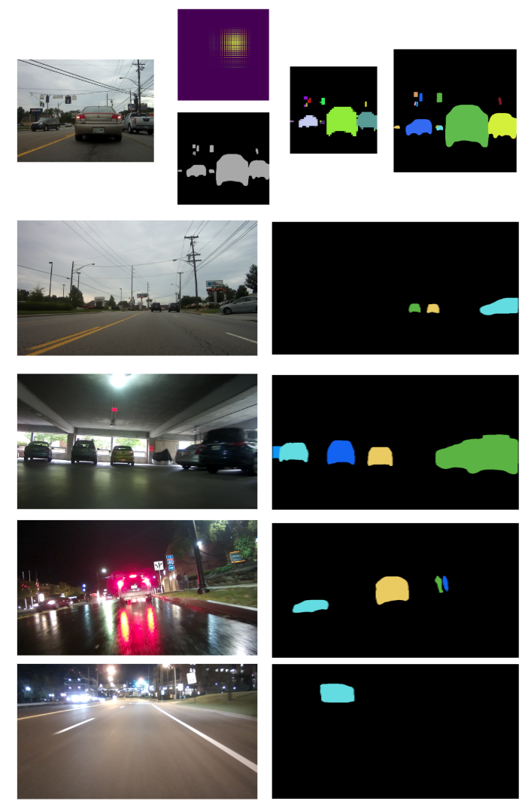

## Personal Project

#### 3D Printed Humanoid Robot Project
<table width="100%">
  <tbody>
    <tr>
      <td align="left" width = "30%">
        
      </td>
      <td align="left" width = "70%">
        Objective: To design and build a cost-effective humanoid robot using 3D-printed parts and carbon fiber materials.
        
This project focuses on minimizing cost and weight by leveraging 3D printing and lightweight structural materials. Carbon fiber tubes act as the robot's primary skeletal structure, while custom-cut carbon fiber plates reinforce the 3D-printed modules. The motors are also 3D-printed, featuring a novel axial flux design that allows for stackable layers to increase torque output. The drivetrain uses a cycloidal reducer, chosen for its compactness and stackable nature. Most components are off-the-shelf, including bearings and steel shafts, simplifying assembly and reducing cost. The robot's bipedal legs have been completed and are used for simulation-based locomotion testing. Each part is modeled with its material, mass, center of mass, and inertia parameters for accurate dynamics simulation.
      </td>
    </tr>
  </tbody>
</table>

## AI Powered Precision Forestry

#### AI-Driven Insights for Precision Forest Health and Resource Assessment

<table width="100%">
  <tbody>
    <tr>
      <td align="left" width = "30%">
        
      </td>
      <td align="left" width = "70%">
        Objective: To design and build a cost-effective humanoid robot using 3D-printed parts and carbon fiber materials.

This project focuses on minimizing cost and weight by leveraging 3D printing and lightweight structural materials. Carbon fiber tubes act as the robot's primary skeletal structure, while custom-cut carbon fiber plates reinforce the 3D-printed modules. The motors are also 3D-printed, featuring a novel axial flux design that allows for stackable layers to increase torque output. The drivetrain uses a cycloidal reducer, chosen for its compactness and stackable nature. Most components are off-the-shelf, including bearings and steel shafts, simplifying assembly and reducing cost. The robot's bipedal legs have been completed and are used for simulation-based locomotion testing. Each part is modeled with its material, mass, center of mass, and inertia parameters for accurate dynamics simulation.
      </td>
    </tr>
  </tbody>
</table>

#### Forestry Drone Development

<table width="100%">
  <tbody>
    <tr>
      <td align="left" width = "30%">
        
      </td>
      <td align="left" width = "70%">
        Objective: To develop an in-house drone platform to mitigate potential DJI drone restrictions.

In light of DJI drone restrictions in certain U.S. states, we developed a custom forestry drone tailored for high-payload applications (up to 40 kg). The drone is designed for long-range operations (30 km patrol range, up to global control via 5G). It can carry diverse sensor arrays to support pest control, disease monitoring, and branch pruning tasks. The 10 km visual control radius ensures reliable near-ground operation. This drone serves as a hardware platform for ForestAI data collection.
      </td>
    </tr>
  </tbody>
</table>

## Assistance Robot 

#### Assistance Robot for Dementia Care 

<table width="100%">
  <tbody>
    <tr>
      <td align="left" width = "30%">
        
      </td>
      <td align="left" width = "70%">
       Objective: To develop an in-house drone platform to mitigate potential DJI drone restrictions.

In light of DJI drone restrictions in certain U.S. states, we developed a custom forestry drone tailored for high-payload applications (up to 40 kg). The drone is designed for long-range operations (30 km patrol range, up to global control via 5G). It can carry diverse sensor arrays to support pest control, disease monitoring, and branch pruning tasks. The 10 km visual control radius ensures reliable near-ground operation. This drone serves as a hardware platform for ForestAI data collection.
        </td>
    </tr>
  </tbody>
</table>

#### Augmented Reality powered construction feild Lofting tool

<table width="100%">
  <tbody>
    <tr>
      <td align="left" width = "30%">
        
      </td>
      <td align="left" width = "70%">
        Objective: To automate layout measurement in large-scale construction sites.

This portable lofting device replaces manual measurement by using laser projection and visual-depth sensing. By interpreting building schematics in real time, it can execute lofting tasks with high precision, reducing time spent on layout by up to 80%. It helps eliminate human error and enhances efficiency in the construction process.
        </td>
    </tr>
  </tbody>
</table>

## Few shot Robot Task Learning 

This project is designed to empower robots to learn complex manipulation tasks using a <ins>**limited number of human-operated demonstrations**</ins>. Developed in 2021, the approach aims to simplify robot teaching for **NON-EXPERTS** while overcoming common challenges such as **noisy data, exploration inefficiencies, and the scarcity of demonstration episodes**.

The problem focused on solving the task learning method in sparse reward, and low success rate tryout espisodes. 

#### [EasyTeaching: A Keyframe-Driven Framework for Robotic Manipulation Learning](https://yanxxx.github.io/EasyTeaching/) 

<table width="100%">
  <tbody>
    <tr>
      <td align="left" width = "30%">
        
      </td>
      <td align="left" width = "70%">
        Objective: Simplify robotic training using keyframe-based demonstration collection.

To support demonstration data collection, I built a teleoperation digital twin system using an HTC VIVE controller and ROS. A differential input model was implemented to resolve revisiting issues. Singularities caused by joint constraints were mitigated through a displacement repositioning strategy. This system simplifies human input collection for robotic excavator tasks.
      </td>
    </tr>
  </tbody>
</table>

#### Engineering work for supporting this project: Teleoperated Colabration Robot Digital Twin 

<table width="100%">
  <tbody>
    <tr>
      <td align="left" width = "30%">
        
      </td>
      <td align="left" width = "70%">
        To efficiently collect demonstartion data, I build a teleoperated cobot digital twin system. The control input of HTC VIVE was choosen (we only have this one) for tracking the huamn control input signal. The system based on the ROS,  the system tracking the controller position as the control input. In order to avoid the absolute position revisiting probelm, I designed the system inmput as the differential input signal. The displacement is only tracked when the controller trigger pressed. 
        As this task is a simulated excavator, the DoF of the robot is reduced which introduced a non-trivial problem of singularities. As the last two joints are locked into (0, 90) position, the singularites dramatically increased. This problem was solved by the proposed  displacement repsotioning method.  
      </td>
    </tr>
  </tbody>
</table>

## Level-2 Autonomous Driving Project 

This project is a preliminary vehicle automation research project. Include: exploring new sensor calibration, vehicle detection with thermal-RGB sensor, lane detection with RGB camera, and panoptic segmentation with RGB camera. 
#### Instance segmentation for vehicle automation

<table width="100%">
  <tbody>
    <tr>
      <td align="left" width = "30%">
        
      </td>
      <td align="left" width = "70%">T
        In this paper, we proposed a coorelationship layer for instance segmenation. In order to distinguish individuls, we evaluate the relationship between every two position in the feature map. As this is a combination problem, this process is time consuming. Since the output still a tensor, we change the explicit evaluation method as CNN layer which geneate the relation map through network. And the explicit method provide the groud truth the relationship map layer. Then connect the relationshape layer to a MLP as 
      </td>
    </tr>
  </tbody>
</table>

#### Distinguish detected lane markers into sepearate lanes 

<table width="100%">
  <tbody>
    <tr>
      <td align="left" width = "30%">
        
      </td>
      <td align="left" width = "70%">
        Over the past decades, the lane detection problem has received considerable attention, primarily focusing on single-lane or adjacent lanes detection scenarios. However, with the increasing demand for further vehicle automation, the lane level localization poses an inevitable challenge, necessitating the detection of an arbitrary number of lanes within a scene. In this paper, we propose a novel instance segmentation method aimed at addressing this complex problem by detecting lane instances. Unlike existing lane detection methods, our approach introduces a similarity module that transforms the segmentation task into a cluster problem. We compute the similarity between every pair of distinct pixels in the image, generating a similarity mask for each pixel. Subsequently, we employ a parallelizable clustering method to merge these masks, producing a reduced set of lane instance results. Furthermore, we integrate our similarity module into a semantic segmentation network, utilizing it as our backbone structure and branching off midway through the network. This integration allows us to leverage the network's semantic understanding capabilities while enhancing instance segmentation performance with our similarity-based approach. In our experimental evaluations, our method achieves impressive results, with an accuracy of 97.1\% and 96.2\% when utilizing the DeeplabV3+ and ENet segmentation networks, respectively. These results highlight the effectiveness and robustness of our proposed method in accurately detecting lane instances, paving the way for advancements in lane-level localization for automated vehicle systems.
      </td>
    </tr>
  </tbody>
</table>

#### Robust Thermal-RGB vehicle detection

<table width="100%">
  <tbody>
    <tr>
      <td align="left" width = "30%">
        
      </td>
      <td align="left" width = "70%">
        The traditional vehicles remain the most prevalent globally, with the exception of the most advanced vehicles equipped with high-end computing and GPU resources. This creates a noticeable gap between traditional vehicles and autonomous vehicles. Developing an onboard device with limited computational resources that can assist traditional vehicles during driving presents promising applications, both in terms of functionality and market potential. To address a wide range of driving conditions, we explore a complementary sensor approach utilizing both RGB and thermal cameras, aiming to cover as many scenarios as possible.
At the same time, the demand for hardware capable of supporting deep learning methods is increasing rapidly. In response, we seek to reduce the computational load of the detection model. The evolution of deep learning techniques has significantly enhanced vehicle detection capabilities. This paper aims to investigate an onboard device for vehicle detection applications. The experimental device used is the NVIDIA Jetson Nano 2GB, a cost-effective, entry-level GPU computing platform. Our results show an mAP5 of 76.8\% on our dataset and 76.3\% on the FLIR ADAS dataset.
      </td>
    </tr>
  </tbody>
</table>

#### Spatial calibration for thermal-rgb cameras and inertial sensor system 

<table width="100%">
  <tbody>
    <tr>
      <td align="left" width = "30%">
        
      </td>
      <td align="left" width = "70%">The light-weight thermal-RGB-inertial sensing units are now gaining increasing research attention, due to their heterogeneous and complementary properties. A robust and accurate registration between a thermal-RGB camera and an inertial sensor is a necessity for effective thermal-RGB-inertial fusion, which is an indispensable procedure for reliable tracking and mapping tasks. This paper presents an accurate calibration method to geometrically correlate the spatial relationships between an RGB camera, a thermal camera and an inertial measurement unit (IMU). The calibration proceeds within the unified calibration framework (thermal-to-RGB, RGB-to-IMU). The extrinsic parameters are estimated by jointly optimizing both the chessboard corner reprojection errors and acceleration and angular velocity error terms. Extensive evaluations have been performed on the collected thermal-RGB-inertial measurements. In this experiments study, the average RMS translation and Euler angle errors are less than 6 mm and 0.04 rad respectively under 20% artificial noise.</td>
    </tr>
  </tbody>
</table>

## Blind Navigation Project

The blind navigation project aim to enhance the acessibility for visual impairment personnel on daily activities. The work includes sensor calibration, ego-motion tracking, relative motion estimation, and dense scene depth estimation. 

#### Wearable ego-motion tracking for blind navigation in indoor environments 
<table width="100%">
  <tbody>
    <tr>
      <td align="left" width = "30%">
        
      </td>
      <td align="left" width = "70%">This paper proposes a method to measure the motion of a moving rigid body using a hybrid visual–inertial sensor. The rotational velocity of the moving object is computed from visual optical flow by solving a depthindependent bilinear constraint, and the translational velocity of the moving object is estimated by solving a dynamics constraint that reveals the relation between scene depth and translational motion. By fusing an inertial sensor, the scale of translational velocities can be estimated, which is otherwise unrecoverable from monocular visual optical flow. An iterative refinement scheme is introduced to deal with observation noise and outliers, and the extended Kalman filter is applied for motion tracking. The performance of the proposed method is evaluated by simulation studies and practical experiments, and the results show the effectiveness of the proposed method in terms of accuracy and robustness.</td>
    </tr>
  </tbody>
</table>

#### Real-scale dense scene depth estimation based on visual-inertial measurements 

<table width="100%">
  <tbody>
    <tr>
      <td align="left" width = "30%">
        
      </td>
      <td align="left" width = "70%">This paper proposes a method to measure the motion of a moving rigid body using a hybrid visual–inertial sensor. The rotational velocity of the moving object is computed from visual optical flow by solving a depthindependent bilinear constraint, and the translational velocity of the moving object is estimated by solving a dynamics constraint that reveals the relation between scene depth and translational motion. By fusing an inertial sensor, the scale of translational velocities can be estimated, which is otherwise unrecoverable from monocular visual optical flow. An iterative refinement scheme is introduced to deal with observation noise and outliers, and the extended Kalman filter is applied for motion tracking. The performance of the proposed method is evaluated by simulation studies and practical experiments, and the results show the effectiveness of the proposed method in terms of accuracy and robustness.</td>
    </tr>
  </tbody>
</table>

#### Relative motion estimation using visual–inertial optical flow  

<table width="100%">
  <tbody>
    <tr>
      <td align="left" width = "30%">
        
      </td>
      <td align="left" width = "70%">This paper proposes a method to measure the motion of a moving rigid body using a hybrid visual–inertial sensor. The rotational velocity of the moving object is computed from visual optical flow by solving a depthindependent bilinear constraint, and the translational velocity of the moving object is estimated by solving a dynamics constraint that reveals the relation between scene depth and translational motion. By fusing an inertial sensor, the scale of translational velocities can be estimated, which is otherwise unrecoverable from monocular visual optical flow. An iterative refinement scheme is introduced to deal with observation noise and outliers, and the extended Kalman filter is applied for motion tracking. The performance of the proposed method is evaluated by simulation studies and practical experiments, and the results show the effectiveness of the proposed method in terms of accuracy and robustness.</td>
    </tr>
  </tbody>
</table>

#### Rotational coordinate transformation for visual-inertial sensor fusion 

<table width="100%">
  <tbody>
    <tr>
      <td align="left" width = "30%">
        
      </td>
      <td align="left" width = "70%">Visual and inertial sensors are used collaboratively in many applications because of their complementary properties. The problem associated with sensor fusion is relative coordinate transformations. This paper presents a quaternion-based method to estimate the relative rotation between visual and inertial sensors. Rotation between a camera and an inertial measurement unit (IMU) is represented by quaternions, which are separately measured to allow the sensor to be optimized individually. Relative quaternions are used so that the global reference is not required to be known. The accuracy of the coordinate transformation was evaluated by comparing with a ground-truth tracking system. The experiment analysis proves the effectiveness of the proposed method in terms of accuracy and robustness. </td>
    </tr>
  </tbody>
</table>

