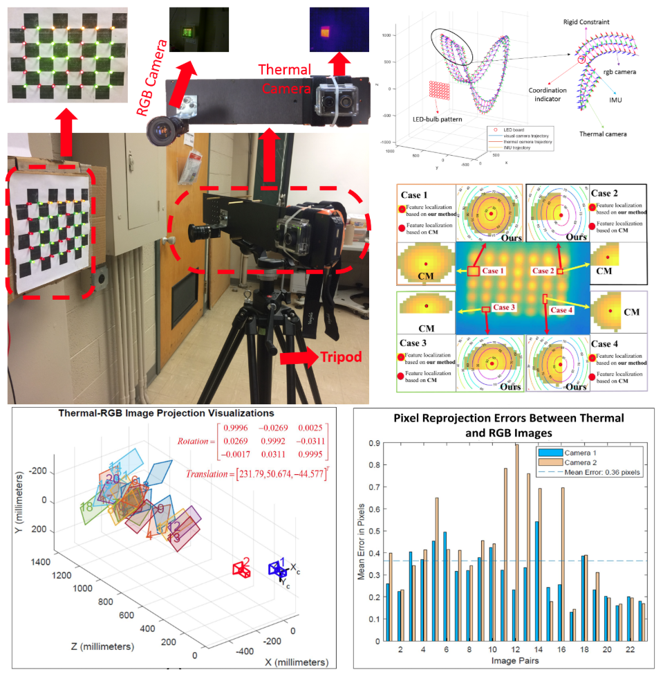

## Personal Project

#### 3D Printed Humanoid Robot Project
<table width="100%">
  <tbody>
    <tr>
      <td align="left" width = "30%">
        
      </td>
      <td align="left" width = "70%">
        This project aim to use as less as possible cost to build a humanoid robot with 3D printed parts and carbon fiber tubes and plates. The carbon fiber tubes is designed as the bone of the whole robot as the weight supporting. And the carbon fiber plates will be cutted into designed shape to complement the structure strengh of 3D printed module. 
        In this project, the motor is also 3D printed. Consider the torque requirement has more priority than speed, in this project, we designed the axile flux motor which is layerwise stackable like sandwishes and generate more torque than just one rotor motor. The reducer is also designed to be produced using 3D printers and as many as possible standard hardwares such as bearings and steel rods. The selected reducer is the cycloidal reducer which is relatively compact vs the reduction ratio. And it is also stackable. 
        All materails selected in this project meant to reduce as much weight as possible. Most 3D printed parts are play support role, and then the carbon fiber plays as the stress role. 
        Currently, this project is activily growing and hosted by myself. for now, this is no partner yet, and no plan to add other contributor for now. 
        The bipal part of the humanoid is done, so I can start running simulation for a humanoid locomotion algorithm earlyer than the whole body design is done. 
        The material of all parts are marked, the mass of each rigid body is estimated, center of mass is estimated which bring us the inertial of the simulation bipedal robot. 
      </td>
    </tr>
  </tbody>
</table>

## AI Powered Precision Forestry

#### AI-Driven Insights for Precision Forest Health and Resource Assessment

<table width="100%">
  <tbody>
    <tr>
      <td align="left" width = "30%">
        
      </td>
      <td align="left" width = "70%">
        Inthe southeastern United States, known as the wood basket of the nation, 70% of U.S. reforestation occurs, producing over 25%
of the world's pulpwood and 18% of its saw timber, so advanced forest monitoring tools are increasingly critical in this region. To
address this need, we developed ForestAI, a web-based platform leveraging artificial intelligence to enhance automated
assessment, monitoring and projection of forest resources and health conditions. 
        Current research priorities include validating the platform's effectiveness with existing data sources and real-world applications,
particularly for early detection of pests and diseases. Future development will focus on integrating emerging technologies,
high-resolution satellite imagery and structural measurements and advanced drone observations, to improve scalability. This
research contributes to modernizing forest monitoring, data analytics, and decision-making support in the southeastern U.S., to
enhance forest productivity and resilience while maintaining high standards of accuracy in resource assessment.
      </td>
    </tr>
  </tbody>
</table>

#### Engineering work for AI forestry

<table width="100%">
  <tbody>
    <tr>
      <td align="left" width = "30%">
        
      </td>
      <td align="left" width = "70%">
        This project is generated for the reason of possible embargo of DJI drones. As the new policy, DJI drone flying is not permitted in Texas already, and a few other states consider to stop importing DJI drones. Under the consideration of avoiding possible risk, we designed our  own Forestry drone for our AI forestry project. 
        This drone is desgined to carray 40 KG cargo airborne, which capable of carrrying more sensors for collecting simutaneous sensor fusion data. And the load consideration is for future project of pest control, desease control, and branch pruning etc. 
        The designed largest patrol distance is 30 Km, and the communication distance can be boost to global with attached 5G module. The visual radio distance is 10 Km.  
      </td>
    </tr>
  </tbody>
</table>

## Assistance Robot 

#### Dementia Care with Quadruped Robot 

<table width="100%">
  <tbody>
    <tr>
      <td align="left" width = "30%">
        
      </td>
      <td align="left" width = "70%">
        This quadruped robot is used to develop a dementia people asssistant. The ultimate goal of this project is to log the patient activites, supervise the patient schedule, acute situation alert, and routine task assistant. 
        The whole project is hosted by Prof. Zhao Xiaopeng. My role in this project is a tech support, which responsible for the detection algorithms, human robot interaction (LLM, Llama2-7B), robot manipulation,  robot task training (supervised learning-BC, and RL based - GAIL, SAC, DDPG, etc.). Most work load on the engineering part (robot locomotion, environment data collectoin, and fine tune LLM for better huamn robot interaction). 
        </td>
    </tr>
  </tbody>
</table>

#### Augmented Reality powered construction feild Lofting 

<table width="100%">
  <tbody>
    <tr>
      <td align="left" width = "30%">
        
      </td>
      <td align="left" width = "70%">
        In the construction feild, the most time consuming part of construction process is that the endless measurement task.  In the standard large construction feild, the standard procedesure is lofting, than building, and lofting again for next step. And the lofting usually done by workers, and people make mistakes. 
        So, in this project, we proposed a portable lofting device which use laser as the drawing pen, visual-depth sensor for the environment perception. Then the device can do the lofting job according to the building sketch. This process can save 80% of workers time on measurement. 
        </td>
    </tr>
  </tbody>
</table>

## Few shot Robot Task Learning 

This project is designed to empower robots to learn complex manipulation tasks using a <ins>**limited number of human-operated demonstrations**</ins>. Developed in 2021, the approach aims to simplify robot teaching for **NON-EXPERTS** while overcoming common challenges such as **noisy data, exploration inefficiencies, and the scarcity of demonstration episodes**.

The problem focused on solving the task learning method in sparse reward, and low success rate tryout espisodes. 

#### [EasyTeaching: A Keyframe-Driven Framework for Robotic Manipulation Learning](https://yanxxx.github.io/EasyTeaching/) 

<table width="100%">
  <tbody>
    <tr>
      <td align="left" width = "30%">
        
      </td>
      <td align="left" width = "70%">
        This project aim to use limited task demonstartion from huamn-operated demonstartion to train the robot do the same job. This project aims to save the NON-ROBOT-EXPERTS from learning robot manipulation techs and programming skills, which usually not related to the users' profession. 
        In this project, a few shot hiearchical reinforcement learning based task exploration method was proposed. The main idea is to utilize the exploration property of the RL to find as many success episodes as possible. However, for a task the involved low probability critical step, the exploration method can never success. So we used a goal conditioned based RL and hindersight buffer reply to increase the positive reward signal, besides, we proposed an episode trajectory evaluation algorithm to refine the collected and explored data for the high level GAIL to learn with high quality data.  And to get ride of robot target input which need expert to craft, a latent space based visual-depth  compression network was proposed. The searching space of latent space dramatically reduced the state-action searching process, and the side affect of this method contributes in the task goal learning from the human demonstrated opeartion. 
      </td>
    </tr>
  </tbody>
</table>

#### Engineering work for supporting this project: Teleoperated Colabration Robot Digital Twin 

<table width="100%">
  <tbody>
    <tr>
      <td align="left" width = "30%">
        
      </td>
      <td align="left" width = "70%">
        To efficiently collect demonstartion data, I build a teleoperated cobot digital twin system. The control input of HTC VIVE was choosen (we only have this one) for tracking the huamn control input signal. The system based on the ROS,  the system tracking the controller position as the control input. In order to avoid the absolute position revisiting probelm, I designed the system inmput as the differential input signal. The displacement is only tracked when the controller trigger pressed. 
        As this task is a simulated excavator, the DoF of the robot is reduced which introduced a non-trivial problem of singularities. As the last two joints are locked into (0, 90) position, the singularites dramatically increased. This problem was solved by the proposed  displacement repsotioning method.  
        
      </td>
    </tr>
  </tbody>
</table>

## Level-2 Autonomous Driving Project 

This project is a preliminary vehicle automation research project. Include: exploring new sensor calibration, vehicle detection with thermal-RGB sensor, lane detection with RGB camera, and panoptic segmentation with RGB camera. 
#### Instance segmentation for vehicle automation

<table width="100%">
  <tbody>
    <tr>
      <td align="left" width = "30%">
        
      </td>
      <td align="left" width = "70%">T
        In this paper, we proposed a coorelationship layer for instance segmenation. In order to distinguish individuls, we evaluate the relationship between every two position in the feature map. As this is a combination problem, this process is time consuming. Since the output still a tensor, we change the explicit evaluation method as CNN layer which geneate the relation map through network. And the explicit method provide the groud truth the relationship map layer. Then connect the relationshape layer to a MLP as 
      </td>
    </tr>
  </tbody>
</table>

#### Distinguish detected lane markers into sepearate lanes 

<table width="100%">
  <tbody>
    <tr>
      <td align="left" width = "30%">
        
      </td>
      <td align="left" width = "70%">
        Over the past decades, the lane detection problem has received considerable attention, primarily focusing on single-lane or adjacent lanes detection scenarios. However, with the increasing demand for further vehicle automation, the lane level localization poses an inevitable challenge, necessitating the detection of an arbitrary number of lanes within a scene. In this paper, we propose a novel instance segmentation method aimed at addressing this complex problem by detecting lane instances. Unlike existing lane detection methods, our approach introduces a similarity module that transforms the segmentation task into a cluster problem. We compute the similarity between every pair of distinct pixels in the image, generating a similarity mask for each pixel. Subsequently, we employ a parallelizable clustering method to merge these masks, producing a reduced set of lane instance results. Furthermore, we integrate our similarity module into a semantic segmentation network, utilizing it as our backbone structure and branching off midway through the network. This integration allows us to leverage the network's semantic understanding capabilities while enhancing instance segmentation performance with our similarity-based approach. In our experimental evaluations, our method achieves impressive results, with an accuracy of 97.1\% and 96.2\% when utilizing the DeeplabV3+ and ENet segmentation networks, respectively. These results highlight the effectiveness and robustness of our proposed method in accurately detecting lane instances, paving the way for advancements in lane-level localization for automated vehicle systems.
      </td>
    </tr>
  </tbody>
</table>

#### Robust Thermal-RGB vehicle detection

<table width="100%">
  <tbody>
    <tr>
      <td align="left" width = "30%">
        
      </td>
      <td align="left" width = "70%">
        The traditional vehicles remain the most prevalent globally, with the exception of the most advanced vehicles equipped with high-end computing and GPU resources. This creates a noticeable gap between traditional vehicles and autonomous vehicles. Developing an onboard device with limited computational resources that can assist traditional vehicles during driving presents promising applications, both in terms of functionality and market potential. To address a wide range of driving conditions, we explore a complementary sensor approach utilizing both RGB and thermal cameras, aiming to cover as many scenarios as possible.
At the same time, the demand for hardware capable of supporting deep learning methods is increasing rapidly. In response, we seek to reduce the computational load of the detection model. The evolution of deep learning techniques has significantly enhanced vehicle detection capabilities. This paper aims to investigate an onboard device for vehicle detection applications. The experimental device used is the NVIDIA Jetson Nano 2GB, a cost-effective, entry-level GPU computing platform. Our results show an mAP5 of 76.8\% on our dataset and 76.3\% on the FLIR ADAS dataset.
      </td>
    </tr>
  </tbody>
</table>

#### Spatial calibration for thermal-rgb cameras and inertial sensor system 

<table width="100%">
  <tbody>
    <tr>
      <td align="left" width = "30%">
        
      </td>
      <td align="left" width = "70%">The light-weight thermal-RGB-inertial sensing units are now gaining increasing research attention, due to their heterogeneous and complementary properties. A robust and accurate registration between a thermal-RGB camera and an inertial sensor is a necessity for effective thermal-RGB-inertial fusion, which is an indispensable procedure for reliable tracking and mapping tasks. This paper presents an accurate calibration method to geometrically correlate the spatial relationships between an RGB camera, a thermal camera and an inertial measurement unit (IMU). The calibration proceeds within the unified calibration framework (thermal-to-RGB, RGB-to-IMU). The extrinsic parameters are estimated by jointly optimizing both the chessboard corner reprojection errors and acceleration and angular velocity error terms. Extensive evaluations have been performed on the collected thermal-RGB-inertial measurements. In this experiments study, the average RMS translation and Euler angle errors are less than 6 mm and 0.04 rad respectively under 20% artificial noise.</td>
    </tr>
  </tbody>
</table>

## Blind Navigation Project

The blind navigation project aim to enhance the acessibility for visual impairment personnel on daily activities. The work includes sensor calibration, ego-motion tracking, relative motion estimation, and dense scene depth estimation. 

#### Wearable ego-motion tracking for blind navigation in indoor environments 
<table width="100%">
  <tbody>
    <tr>
      <td align="left" width = "30%">
        
      </td>
      <td align="left" width = "70%">This paper proposes a method to measure the motion of a moving rigid body using a hybrid visual–inertial sensor. The rotational velocity of the moving object is computed from visual optical flow by solving a depthindependent bilinear constraint, and the translational velocity of the moving object is estimated by solving a dynamics constraint that reveals the relation between scene depth and translational motion. By fusing an inertial sensor, the scale of translational velocities can be estimated, which is otherwise unrecoverable from monocular visual optical flow. An iterative refinement scheme is introduced to deal with observation noise and outliers, and the extended Kalman filter is applied for motion tracking. The performance of the proposed method is evaluated by simulation studies and practical experiments, and the results show the effectiveness of the proposed method in terms of accuracy and robustness.</td>
    </tr>
  </tbody>
</table>

#### Real-scale dense scene depth estimation based on visual-inertial measurements 

<table width="100%">
  <tbody>
    <tr>
      <td align="left" width = "30%">
        
      </td>
      <td align="left" width = "70%">This paper proposes a method to measure the motion of a moving rigid body using a hybrid visual–inertial sensor. The rotational velocity of the moving object is computed from visual optical flow by solving a depthindependent bilinear constraint, and the translational velocity of the moving object is estimated by solving a dynamics constraint that reveals the relation between scene depth and translational motion. By fusing an inertial sensor, the scale of translational velocities can be estimated, which is otherwise unrecoverable from monocular visual optical flow. An iterative refinement scheme is introduced to deal with observation noise and outliers, and the extended Kalman filter is applied for motion tracking. The performance of the proposed method is evaluated by simulation studies and practical experiments, and the results show the effectiveness of the proposed method in terms of accuracy and robustness.</td>
    </tr>
  </tbody>
</table>

#### Relative motion estimation using visual–inertial optical flow  

<table width="100%">
  <tbody>
    <tr>
      <td align="left" width = "30%">
        
      </td>
      <td align="left" width = "70%">This paper proposes a method to measure the motion of a moving rigid body using a hybrid visual–inertial sensor. The rotational velocity of the moving object is computed from visual optical flow by solving a depthindependent bilinear constraint, and the translational velocity of the moving object is estimated by solving a dynamics constraint that reveals the relation between scene depth and translational motion. By fusing an inertial sensor, the scale of translational velocities can be estimated, which is otherwise unrecoverable from monocular visual optical flow. An iterative refinement scheme is introduced to deal with observation noise and outliers, and the extended Kalman filter is applied for motion tracking. The performance of the proposed method is evaluated by simulation studies and practical experiments, and the results show the effectiveness of the proposed method in terms of accuracy and robustness.</td>
    </tr>
  </tbody>
</table>

#### Rotational coordinate transformation for visual-inertial sensor fusion 

<table width="100%">
  <tbody>
    <tr>
      <td align="left" width = "30%">
        
      </td>
      <td align="left" width = "70%">Visual and inertial sensors are used collaboratively in many applications because of their complementary properties. The problem associated with sensor fusion is relative coordinate transformations. This paper presents a quaternion-based method to estimate the relative rotation between visual and inertial sensors. Rotation between a camera and an inertial measurement unit (IMU) is represented by quaternions, which are separately measured to allow the sensor to be optimized individually. Relative quaternions are used so that the global reference is not required to be known. The accuracy of the coordinate transformation was evaluated by comparing with a ground-truth tracking system. The experiment analysis proves the effectiveness of the proposed method in terms of accuracy and robustness. </td>
    </tr>
  </tbody>
</table>

